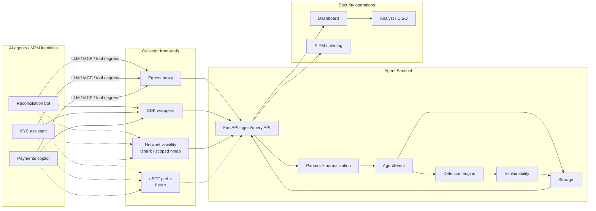
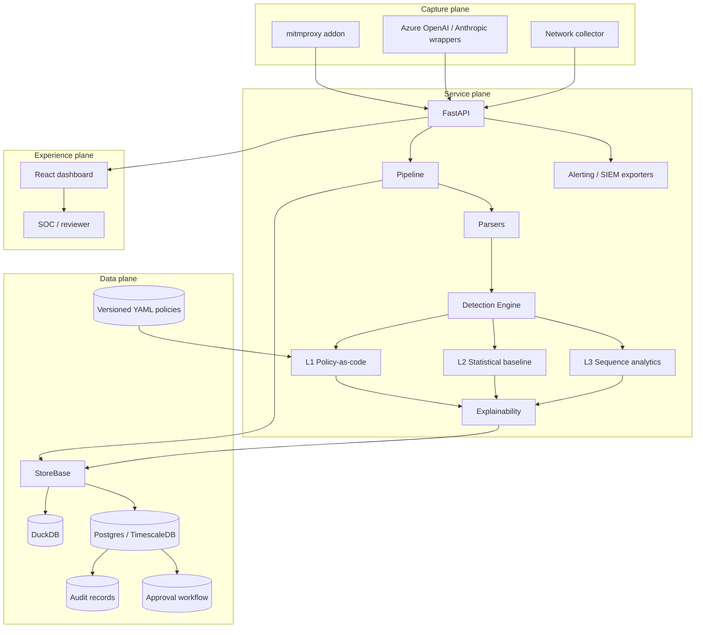
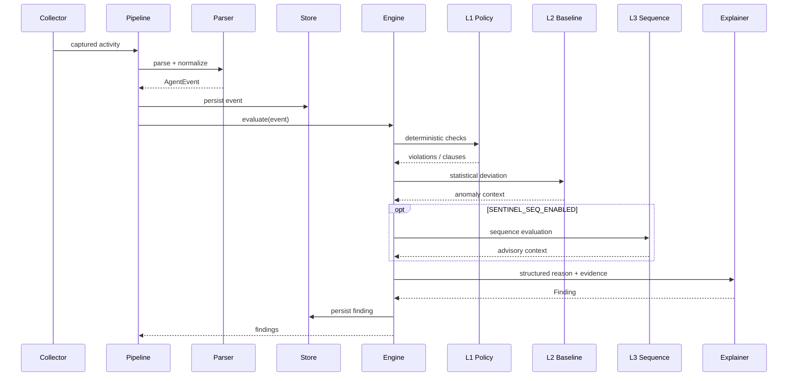
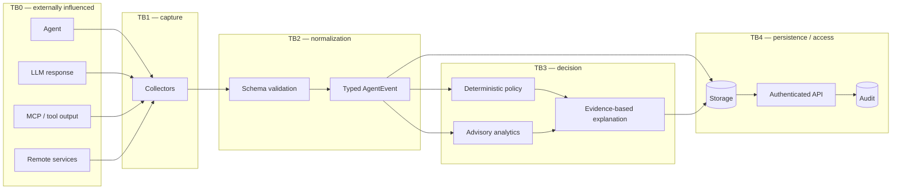
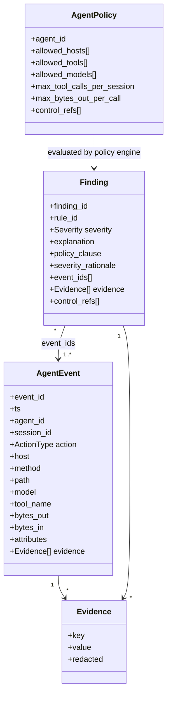
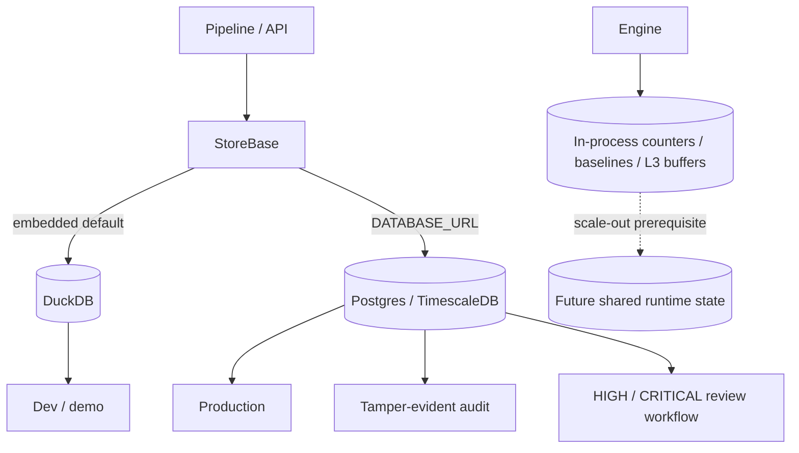
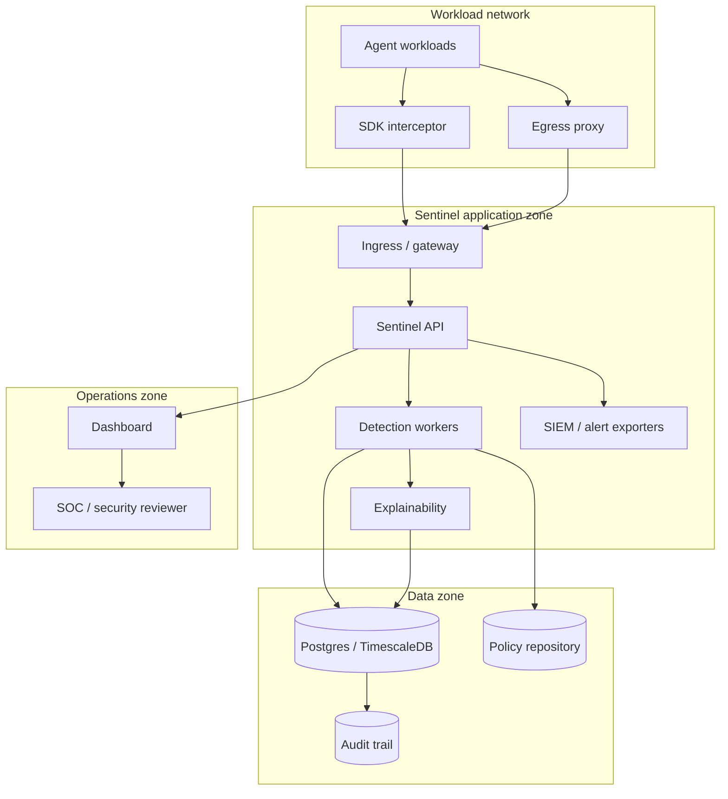
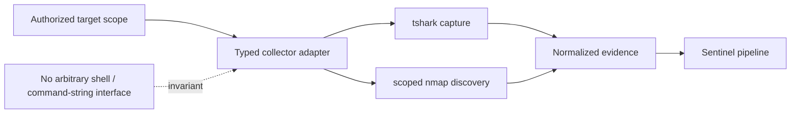

# Agent Sentinel — Architecture

Agent Sentinel is an explainable flight recorder and behavioral firewall for AI agents and machine-to-machine identities. The architecture is deliberately **rules-first**: deterministic policy is the authoritative detection layer; statistical and sequence analytics add context but do not silently become enforcement authority.

## 1. System context

Solid paths represent current architectural capabilities; dashed paths are optional/future visibility mechanisms. Every collector converges on the same normalized event contract.

## 2. Container / logical architecture

## 3. Detection pipeline

The trust order is **L1 deterministic policy → L2 statistical context → optional L3 sequence context**. L3 is feature-flagged, advisory-only and must not create an independent deny path.

## 4. Trust-boundary architecture

**Security invariant:** external/model/tool content is data. It cannot acquire policy authority merely because it appears in a captured payload.

## 5. Data model

## 6. Storage architecture

DuckDB intentionally provides a reduced-function local mode. Deployments requiring retained audit trails or review workflows require the production Postgres backend. Current behavioral counters/baselines/session buffers are per-process; multi-replica consistency therefore requires shared runtime state before horizontal scaling is considered authoritative.

### Backend capability matrix

| Capability | DuckDB (default, embedded) | Postgres/TimescaleDB |
|---|---|---|
| Events + findings | ✅ | ✅ |
| Aggregate stats | ✅ | ✅ |
| Hash-chained audit log | ❌ refuses (501) | ✅ |
| Audit chain verification | ❌ refuses (501) | ✅ |
| Approval workflow (HIGH/CRITICAL review) | ❌ refuses (501) | ✅ |

"Reduced-function" means these surfaces **raise** on DuckDB
(`AuditNotSupportedError` / `ApprovalsNotSupportedError`, both
`NotImplementedError` subclasses), and the API maps that to **501 Not
Implemented** with the remedy in the message.

They were previously silent no-ops returning success, which is not the same
thing as safe: `POST /approvals/{id}` answered `200 {"msg": "recorded"}` having
recorded nothing, and `GET /audit-log` returned an empty list indistinguishable
from "no activity" — on the backend the quickstart actually runs. A backend that
cannot record a compliance decision must refuse it, and name the remedy (CR-18).

### Runtime state and concurrency

`Pipeline` holds two locks rather than one. The engine's in-memory state
(volume counters, baselines, L3 session buffers) is shared across Starlette's
threadpool and always needs serializing. Storage writes are serialized *only*
on a backend that declares `StoreBase.thread_safe = False` — the embedded
DuckDB connection. On PostgreSQL, whose pooled per-thread connections are
already safe, storage writes run concurrently. A single lock around both
previously capped ingest throughput at one flow at a time on every backend
(CR-19).

The shared lock is an `RLock`: `engine.evaluate()` reads the store through
`BaselineStore.get()`, so on DuckDB the store lock is re-entered by the same
thread.

## 7. Deployment topology

## 8. Network collector boundary

Active discovery is not a generic execution facility. Target scope, arguments, duration and resource use must be bounded independently of any agent/model request.

## 9. Architectural decisions and trade-offs

| Decision | Choice | Trade-off / rationale |
|---|---|---|
| Primary detection | Deterministic policy-as-code | Strong auditability and predictable behavior; requires explicit policy lifecycle. |
| Secondary detection | Statistical baseline | Adds behavioral context without replacing policy authority. |
| Sequence detection | Optional advisory L3 | Better multi-step context; feature flag and fail-open behavior limit operational coupling. |
| Capture | Proxy + SDK wrappers | Proxy reduces agent changes; wrappers reduce infrastructure changes. Both normalize to one schema. |
| Event contract | `AgentEvent` | Collector independence and stable downstream semantics. |
| Explanation | Deterministic from evidence | Audit-friendly; less free-form than generative explanation. |
| Local storage | DuckDB | Simple single-node operation; intentionally lacks production audit/approval semantics. |
| Production storage | Postgres/TimescaleDB | Multi-writer durability and workflow support at greater operational cost. |
| Network visibility | Bounded collector adapters | Useful visibility without turning Sentinel into an arbitrary remote shell. |

## 10. Architecture principles

1. **Rules first, models second.** Deterministic policy is the authoritative detection mechanism.
2. **Normalize once.** All collectors converge on a typed, transport-independent event contract.
3. **Evidence is the source of truth.** Explanations and compliance mappings derive from structured evidence.
4. **Treat observed content as untrusted data.** LLM/tool/network strings never become instructions to Sentinel.
5. **Separate observation from execution.** Network visibility adapters expose narrow capabilities, not arbitrary shell access.
6. **Make degraded modes explicit.** DuckDB and optional analytics have intentionally different guarantees from the production stack.
7. **Do not hide distributed-state limitations.** Scale-out requires shared state for counters, baselines and session-aware analytics.
8. **Prefer auditable failure behavior.** Optional analytics may fail open for ingestion; authoritative schema/policy/security controls must remain explicit and observable.

See [`docs/adr/0001-rules-first-detection.md`](adr/0001-rules-first-detection.md).
