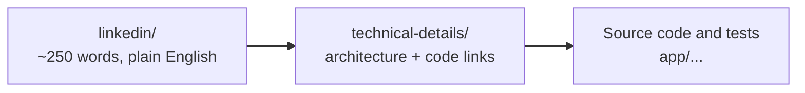

# Agent Sentinel — 10-part blog series

**Positioning:** Agent Sentinel is an explainable runtime observability and
policy-detection layer for AI agents. It detects, explains, stores, and
exports evidence-rich findings into SOC platforms such as Microsoft Sentinel
and Splunk.

**Current product line:** Detect. Explain. Export.
**Roadmap:** Enforce, through a separately reviewed pre-action gateway. The
current engine produces post-observation findings; it does not block or
quarantine actions.

## Two audiences, two levels

Every part has a plain-English LinkedIn post for CISOs and business readers,
and a technical write-up (with an "In plain terms" summary up top) for
architects and engineers. The [traceability matrix](TRACEABILITY.md) ties each claim to its implementation,
its regression test, and its current-versus-roadmap boundary.

| # | Part | LinkedIn post | Technical write-up | Main code | Regression test |
|---|---|---|---|---|---|
| 1 | Why AI Agents Need a Flight Recorder | [post](linkedin/01-why-agents-need-a-flight-recorder.md) | [read](technical-details/01-why-agents-need-a-flight-recorder.md) | `pipeline.py`, `detection/engine.py` | [`test_pipeline.py`](../../app/tests/test_pipeline.py) |
| 2 | From Simulated Traffic to Real Model Calls | [post](linkedin/02-simulation-to-real-models.md) | [read](technical-details/02-simulation-to-real-models.md) | `collector/azure_openai.py`, `anthropic_sdk.py`, `redaction.py` | [`test_collector_contracts.py`](../../app/tests/test_collector_contracts.py) |
| 3 | Rules First, Statistics Second | [post](linkedin/03-rules-first-statistics-second.md) | [read](technical-details/03-rules-first-statistics-second.md) | `detection/engine.py`, `policy.py`, `sequence_layer.py` | [`test_sequence_layer.py`](../../app/tests/test_sequence_layer.py) |
| 4 | The Enterprise Foundation | [post](linkedin/04-enterprise-foundation.md) | [read](technical-details/04-enterprise-foundation.md) | `api/auth.py`, `api/audit.py`, `storage/pg_store.py` | [`test_auth.py`](../../app/tests/test_auth.py) |
| 5 | Feeding the SOC, and What's Next | [post](linkedin/05-soc-and-whats-next.md) | [read](technical-details/05-soc-and-whats-next.md) | `siem/log_analytics.py`, `alerting/webhook.py` | [`test_siem_log_analytics.py`](../../app/tests/test_siem_log_analytics.py) |
| 6 | The Blind Spot Every AI-Agent Firewall Has | [post](linkedin/06-the-blind-spot-every-agent-firewall-has.md) | [read](technical-details/06-the-blind-spot-every-agent-firewall-has.md) | `collector/proxy.py`, `network_scan.py` | [`test_network_capture.py`](../../app/tests/test_network_capture.py) |
| 7 | Visibility Without a Blank Check | [post](linkedin/07-visibility-without-a-blank-check.md) | [read](technical-details/07-visibility-without-a-blank-check.md) | `collector/host_map.py`, `scan_config.py` | [`test_network_host_map.py`](../../app/tests/test_network_host_map.py) |
| 8 | From Open Port to Explainable Finding | [post](linkedin/08-from-open-port-to-explainable-finding.md) | [read](technical-details/08-from-open-port-to-explainable-finding.md) | `InventoryJob`, `baseline.new_listening_port` | [`test_network_inventory.py`](../../app/tests/test_network_inventory.py) |
| 9 | Built to Fail Safe, Not Fail Quiet | [post](linkedin/09-built-to-fail-safe-not-fail-quiet.md) | [read](technical-details/09-built-to-fail-safe-not-fail-quiet.md) | `parse_ek_line`, `net.host_not_allowed` | [`test_network_pipeline.py`](../../app/tests/test_network_pipeline.py) |
| 10 | What This Doesn't Do Yet | [post](linkedin/10-what-this-doesnt-do-yet.md) | [read](technical-details/10-what-this-doesnt-do-yet.md) | `network_scan.py` capture supervisor, `policy.py` | [`test_network_spec_fidelity_audit.py`](../../app/tests/test_network_spec_fidelity_audit.py) |

Every link in this folder is relative, so the article, the code, and the tests
always resolve on the same repository version. Run `python scripts/check_links.py` to verify
every relative link and heading anchor.

## Publishing plan

One part per week, on Tuesdays, technical write-up and LinkedIn post in the
same week. Publish in numeric order: Parts 5 and 10 each close a series and
refer back to the parts before them. If a week is missed, shift the whole
column, not individual rows.

| Week of | Part | Goal |
|---|---|---|
| 2026-10-06 | 1. Why AI Agents Need a Flight Recorder | Establish the problem |
| 2026-10-13 | 2. From Simulated Traffic to Real Model Calls | Show the working MVP and the real-SDK pivot |
| 2026-10-20 | 3. Rules First, Statistics Second | Build technical credibility, including the sequence-model pivot |
| 2026-10-27 | 4. The Enterprise Foundation | Show what makes it serious for CISOs |
| 2026-11-03 | 5. Feeding the SOC, and What's Next | Clarify positioning and roadmap; series 1 closes |
| 2026-11-10 | 6. The Blind Spot Every AI-Agent Firewall Has | Reopen on a concrete new capability |
| 2026-11-17 | 7. Visibility Without a Blank Check | Show the scoping discipline before the capability |
| 2026-11-24 | 8. From Open Port to Explainable Finding | Technical credibility on the network collector |
| 2026-12-01 | 9. Built to Fail Safe, Not Fail Quiet | The most shareable post: a real bug caught before shipping |
| 2026-12-08 | 10. What This Doesn't Do Yet | Close on honesty and the roadmap |

Before the first post: make this repository public (the LinkedIn posts link to
it by absolute URL), and merge the working branch into `main`.

## Scope of this repository

This is a trimmed copy of the Agent Sentinel product repository, holding only
the code, tests, config, and docs that the ten parts cite. The SDLC harness,
infrastructure, and roadmap ADRs stay in the main repository.
