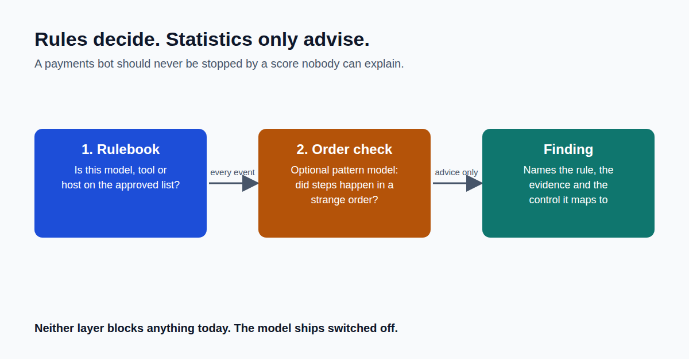

A wire transfer is allowed. A wire transfer before the identity check is a breach.

A list of rules can't tell those apart. It checks one step at a time.

So I made a deliberate choice about who gets the final say.

The rulebook decides: is this model, tool or destination allowed for this agent? Every finding names the rule and the evidence, so an auditor can check it and a human can challenge it.

A pattern model only advises. It can flag that steps happened in a suspicious order, but it can never overrule a rule, and it ships switched off.

Why? Because "the model scored it 0.87" is not an answer you can defend to a regulator. "It broke rule X, here's the evidence" is.

I've also published where the pattern model struggles: small, quiet attacks buried in long sessions.

This is Part 3 of a 10-part series on building it.
Next week: Part 4, The Enterprise Foundation.

Where have you seen a clever score hide the thing that actually mattered?

First comment: Read the full article → https://anandnarayanan.net/blog/agent-sentinel-03-rules-first-statistics-second/
Code and tests: https://github.com/anandnarayanan2017/agent-sentinel-series

#AIAgents #ExplainableAI #AIGovernance #RegTech
