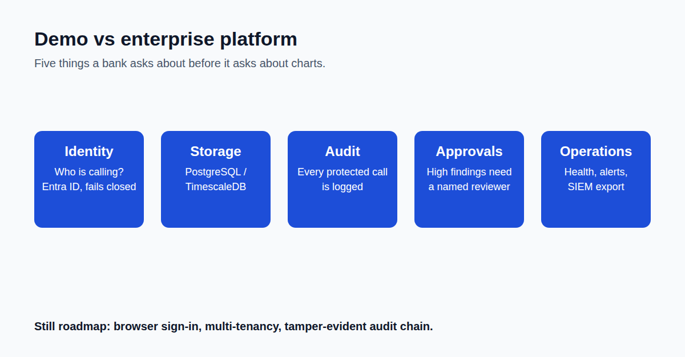

The difference between a demo and an enterprise platform is not prettier charts.

It's identity, storage, auditability, approvals, and operations.

A working proof of concept and something a bank's security team will actually approve are two different bars. The gap isn't features you can screenshot. It's the plumbing underneath: who is allowed to call this system, where does the data actually live, is there a record of who looked at what, and does a risky finding wait for a human before anything happens.

So phase three of building Agent Sentinel wasn't about detecting more things. It was about making the existing detection trustworthy at enterprise scale.

Real identity verification instead of an open endpoint. A proper database instead of a local file. An audit trail that captures who accessed what. An approval queue so a high-severity finding waits for a human decision instead of silently logging and moving on.

We also chose to be upfront about what's still a gap rather than paper over it. No multi-tenant isolation yet. Policy still lives in files instead of a managed workflow. No message-queue-backed ingestion for traffic bursts.

A roadmap you can point to is more credible than a feature list that quietly implies everything is already solved.

One more thing worth saying plainly: every change to this codebase, including this one, goes through a two-gate review process. A human signs off on what's being built before work starts, and a human approves the evidence before anything ships.

That discipline is part of the audit-ready-by-design pitch, not separate from it.

What's the one piece of enterprise plumbing you'd never skip, even under deadline pressure?

Read the full article: https://anandnarayanan.net/blog/agent-sentinel-04-enterprise-foundation/
