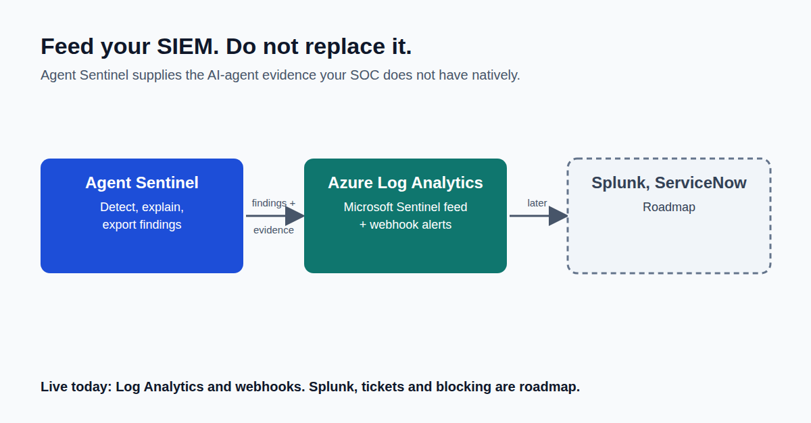

Agent Sentinel should not be another SIEM.

Every security team I'd want to work with already has Microsoft Sentinel or Splunk. They don't need another screen.

What they don't have is evidence about what an AI agent actually did: which agent, which model, which tool, where the data went, and whether any of it was allowed.

So I made Agent Sentinel's job end where the SOC's job begins. Detect it. Explain it in plain language. Export it into the tools the team already trusts.

Each finding arrives already explained: the rule it broke, the evidence, and the regulatory control it relates to. Blocking is on the roadmap, not in the product today.

That's the bet: not out-building the SIEM, but feeding it what it's missing.

This is Part 5 of a 10-part series. Next, I look at what a proxy can't see.

What AI-agent evidence do you most wish showed up in your existing SOC tools?

First comment: Read the full article → https://anandnarayanan.net/blog/agent-sentinel-05-soc-and-whats-next/
Code and tests: https://github.com/anandnarayanan2017/agent-sentinel-series

#AIAgents #SOC #MicrosoftSentinel #Splunk
