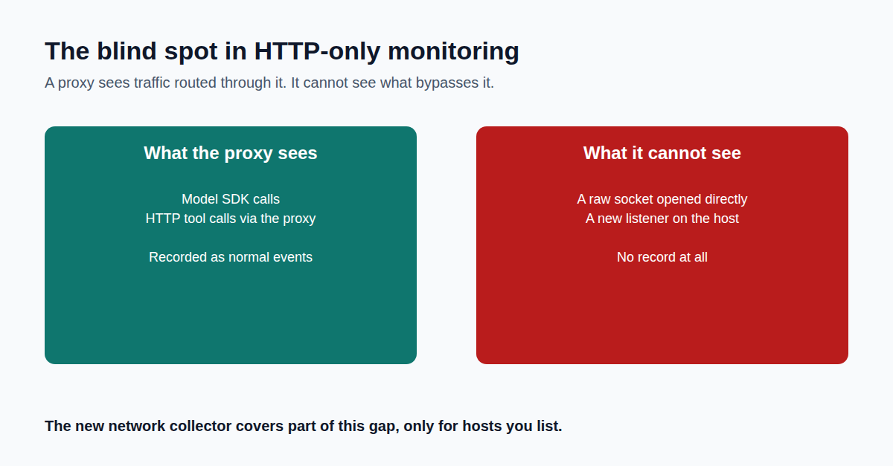

Your egress proxy sees the HTTP calls routed through it.

What does it see when the agent stops asking permission?

Most AI-agent security tools work the same way: put a proxy in front of the agent, and it watches every web request go past. That's real protection, but only if the agent's traffic actually goes through that proxy.

Here's the problem. If an agent's process opens a raw network connection directly, not an API call, not a web request, just a socket, your proxy never sees it. Same if something starts listening for an incoming connection.

It's not that this traffic gets logged as unknown. It doesn't get logged at all. There's no partial record. It's a total blind spot.

For a reconciliation bot or a KYC assistant handling regulated data, that gap matters most exactly when it matters most: a compromised dependency, a prompt injection that gets an agent to run code it shouldn't. None of that has to ask permission from your proxy config. It just needs the network stack to still work, which it always does.

So we built a second way of watching. Instead of only watching the agent's own outgoing calls, we also watch the wire itself, scoped strictly to the machines that matter. Not a general network scanner. A narrow, permissioned view of exactly the hosts your agents run on.

The image below shows the gap: what a normal collector sees versus what's actually happening underneath it.

If you run AI agents in production today, does your current monitoring see anything that isn't an API call?

Full write-up, with code links: https://github.com/anandnarayanan2017/agent-sentinel-series/blob/main/docs/blog/technical-details/06-the-blind-spot-every-agent-firewall-has.md
