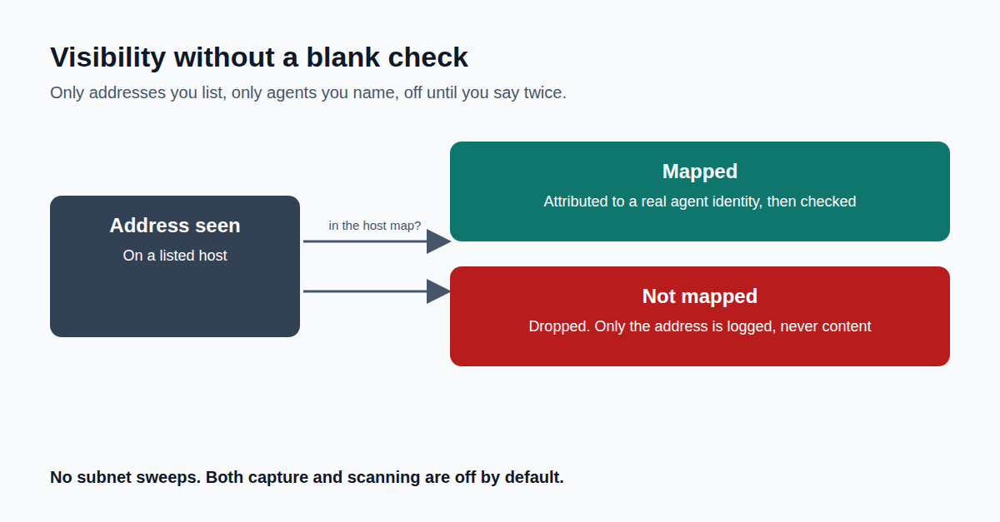

A network monitor that watches everything is a liability, not a control.

The moment you add network visibility, you've created something your own security team has to worry about.

So I built Agent Sentinel's network watcher around three hard limits.

It only watches machines you name, one address at a time. No sweeping a network.

It never guesses whose traffic it is. Every address is mapped to a named agent in advance. Anything else is dropped, with only the address logged.

It's off until someone decides twice: once to write the list, once to switch it on.

That's what lets a security review approve it without a page of caveats.

This is Part 7 of a 10-part series on building it.

Where do you draw the line between useful visibility and a new risk?

First comment: Read the full article → https://anandnarayanan.net/blog/agent-sentinel-07-visibility-without-a-blank-check/
