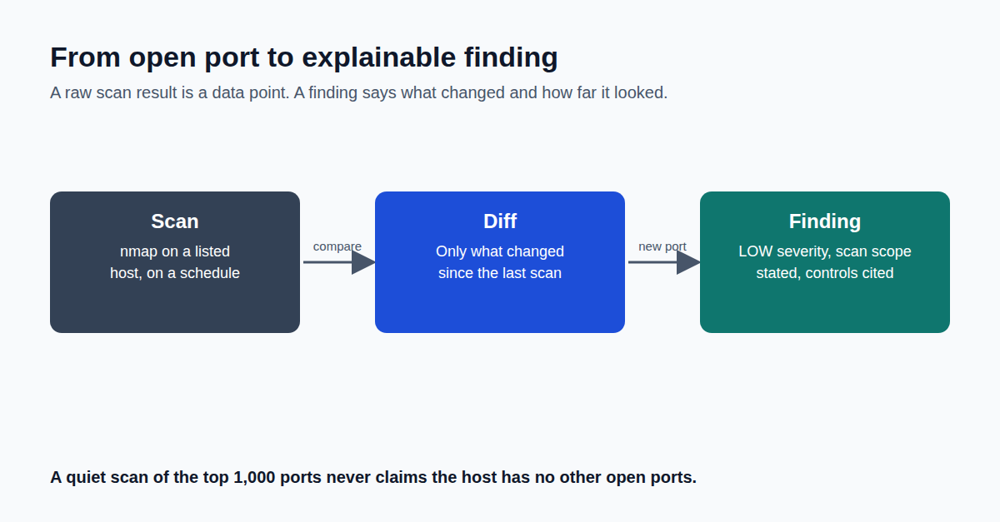

New port detected is not a finding a CISO can act on.

Here's what actually turns a packet into evidence.

A raw scan result is a data point, not a decision. What makes it useful to a security reviewer, or defensible to an auditor, is everything that happens between "we saw something" and "here's what it means."

Three things we insist on for every finding this system produces.

It always says exactly how thorough the check was. We run two kinds of scans: a fast one covering the 1,000 most common ports, hourly, and a slow, complete one covering every possible port, once a day. Every finding states which kind produced it. A quiet result from the fast scan is not the same claim as a quiet result from the complete one, and we never let it read that way.

The severity matches what we actually know. A newly open port on a known machine is unusual, worth a look, but it's not proof of a policy violation. So it's flagged as low-severity and advisory, not a high-severity alarm. We'd rather under-claim than manufacture urgency the evidence doesn't support.

Every finding points back to a real compliance obligation. Not a generic anomaly score. A specific reference an auditor can trace, tied to the actual regulatory frameworks this kind of finding falls under.

The diagram traces the full path: a scan result comes in, gets compared against what we've seen before, and only if it's genuinely new becomes a finding with all three of the above attached.

The uncomfortable truth about most security tooling: an unlabeled clean result and a we-didn't-actually-check-that result look identical on a dashboard. How does your team tell them apart?

Full write-up, with code links: https://github.com/anandnarayanan2017/agent-sentinel-series/blob/main/docs/blog/technical-details/08-from-open-port-to-explainable-finding.md
