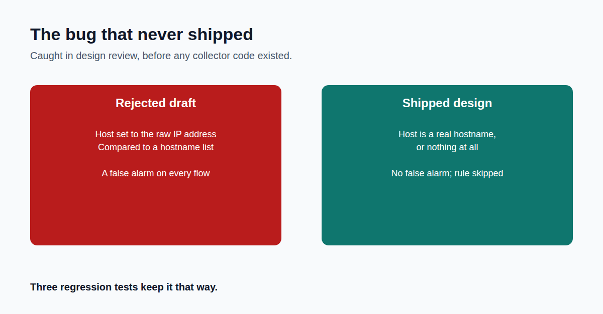

The bug that never shipped: one design choice away from flagging every agent as a violator.

This is the story I most wanted to tell in this series.

Agent Sentinel has a long-standing rule: if an agent sends data to a destination that isn't on its approved list, that's a high-severity violation. The approved list uses names.

An early design of the new network feature would have recorded only number addresses. A number never matches a name. So every legitimate agent would have failed every check, on every connection.

Not a missed detection. A flood of false alarms. And a tool that cries wolf trains people to stop reading it.

It was caught in design review, before any of that code existed. The fix: the rule uses a real name or stands aside, and tests prove normal traffic stays quiet.

This is Part 9 of a 10-part series on building it.

Where is your team's cheapest place to catch a mistake like this?

First comment: Read the full article → https://anandnarayanan.net/blog/agent-sentinel-09-built-to-fail-safe-not-fail-quiet/
