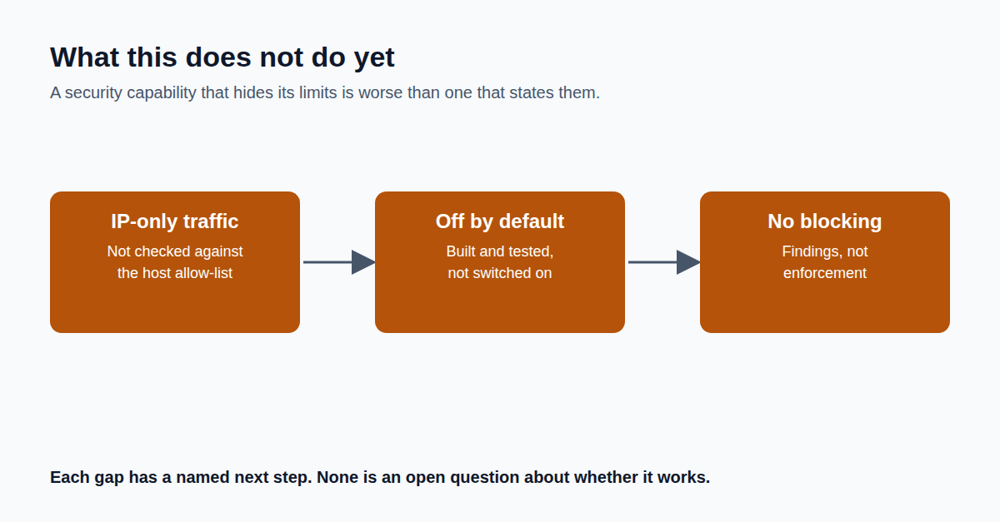

The gap we shipped with, and why closing it wasn't the right call for v1.

Closing out this series with the thing most product posts skip: what doesn't work yet, and why we chose not to force it in.

Gap one. If network traffic comes from a machine with no resolvable name, no clean hostname available anywhere, that traffic doesn't get checked against an agent's approved-host list. Not because the check is broken, but because there's nothing to compare.

The traffic isn't invisible, we still flag genuinely new open ports, but this one specific rule doesn't reach it yet. Closing this properly means teaching the approval-list rule to understand raw IP addresses safely, without recreating the exact false-alarm bug from yesterday's post. That's a real design decision, not a quick patch, and we're deferring it on purpose.

Gap two. This entire capability ships built, tested, and turned off. Actually running it against a live environment wasn't part of this release. It requires two separate, deliberate steps from an operator before anything happens: naming which machines it's allowed to watch, and switching it on.

We treat that the same way we treat any other this-will-actively-touch-production decision: a human call, not a default.

Neither of these is a secret. Both are written down plainly in our internal docs, the same place a customer's security team would look.

If you had to choose: ship a security capability that's honest about what it doesn't cover yet, or wait until it covers everything? We chose the first.

That's the series. Thanks for following along. What would you want covered next?

Full write-up, with code links: https://github.com/anandnarayanan2017/agent-sentinel-series/blob/main/docs/blog/technical-details/10-what-this-doesnt-do-yet.md
