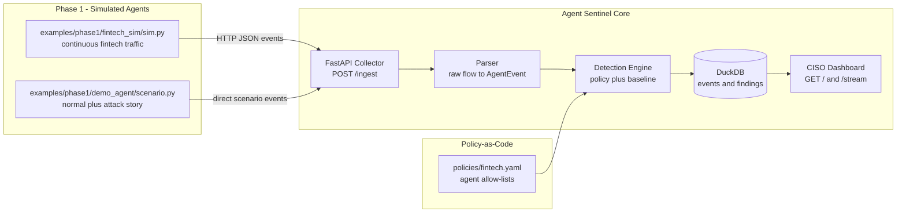
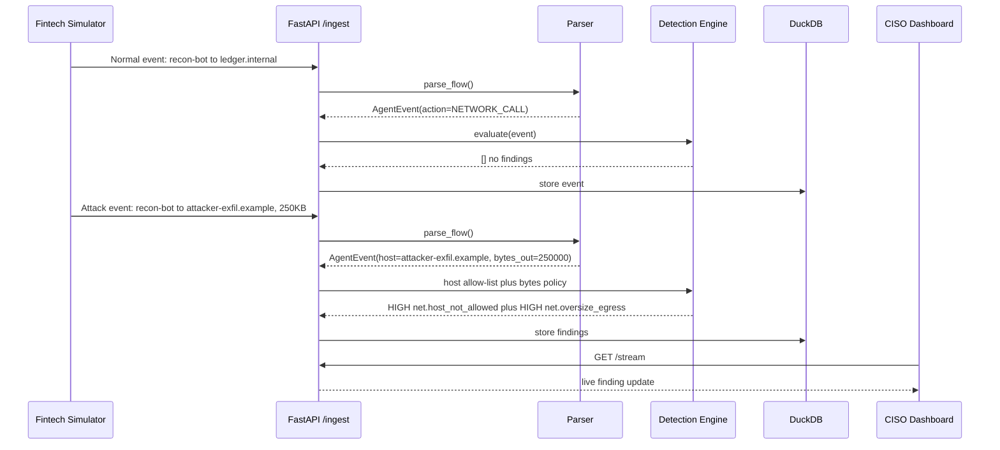
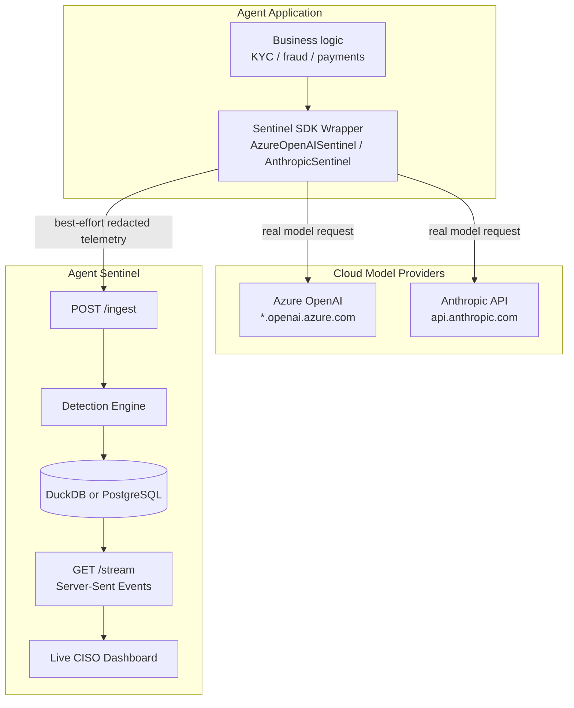
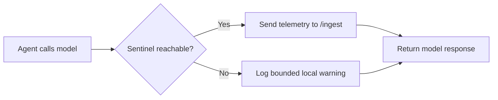

# Part 2 — From Simulated Traffic to Real Model Calls

> **Reader path:** [LinkedIn post](../linkedin/02-simulation-to-real-models.md) → this design → [code-and-test traceability](../TRACEABILITY.md#publication-traceability)

## In plain terms

**Example.** Picture a KYC assistant using one of those wrapped methods. The wrapper sends a small record with best-effort sensitive-value redaction and bounded previews. This lowers exposure; it is not proof that arbitrary free text contains no personal or confidential data. If delivery fails, central evidence is missing for that interval, so operators must monitor the local delivery warnings.

**Why it matters.** This is the difference between a monitoring tool your operations team trusts and one they quietly work around. A monitoring system that can accidentally take down production the moment it hiccups is a worse outcome than a brief recording gap — teams route around tools like that, which defeats the entire purpose. Prove a system is trustworthy on safe data first, then let it watch real traffic, and never let it become the reason a critical process goes down. That ordering is a discipline, not an accident.

## Design and implementation

Phase 1 proves the core idea with simulated fintech traffic, deterministic policy checks, DuckDB storage, and a local dashboard. Phase 2 then swaps simulation for real Azure OpenAI / Anthropic calls without changing the core loop.

## Phase 1 — the POC flight recorder



| Capability | Implementation |
|---|---|
| Event simulation | [`examples/phase1/fintech_sim/sim.py`](../../../examples/phase1/fintech_sim/sim.py) creates realistic fintech network traffic |
| Policy-as-code | [`policies/fintech.yaml`](../../../policies/fintech.yaml) defines allowed hosts, tools, models, bytes, and controls |
| Normalization | `parse_flow()` converts raw traffic into one `AgentEvent` schema |
| Detection | Rules catch unapproved hosts, tools, models, oversize egress, and rate violations |
| Evidence | Findings include title, rule, severity, explanation, evidence, and control refs |
| Storage | DuckDB tables: `events` and `findings` |
| UX | Local CISO board with severity cards, charts, filters, evidence drawer, event feed |

```yaml
agents:
  - agent_id: recon-bot
    allowed_hosts:
      - api.anthropic.com
      - ledger.internal
      - reports.internal
    allowed_tools:
      - read_ledger
      - send_report
    allowed_models:
      - claude-sonnet-4-6
    max_tool_calls_per_session: 20
    max_bytes_out_per_call: 100000
    control_refs:
      - "DORA Art.10 (anomaly detection)"
      - "EU AI Act Art.12 (high-risk AI logging, when in scope)"
      - "CSSF 20/750 as amended (ICT risk; confirm entity scope)"
```



## Phase 2 — real cloud models



```python
from sentinel.collector.azure_openai import AzureOpenAISentinel

client = AzureOpenAISentinel(
    azure_endpoint=os.environ["AZURE_OPENAI_ENDPOINT"],
    api_key=os.environ["AZURE_OPENAI_API_KEY"],
    api_version=os.environ["AZURE_OPENAI_API_VERSION"],
    sentinel_api=os.environ.get("SENTINEL_API", "http://localhost:8000"),
    sentinel_auth_token=os.environ["SENTINEL_AUTH_TOKEN"],
    agent_id="kyc-agent",
    session_id="kyc-run-001",
)

response = client.chat.completions.create(
    model=os.environ["AZURE_OPENAI_DEPLOYMENT"],
    messages=[
        {"role": "user", "content": "Summarize this KYC discrepancy."}
    ],
)
```

| Step | What Happens |
|---|---|
| 1 | Sends the real call to Azure OpenAI or Anthropic |
| 2 | Applies best-effort sensitive-field/pattern redaction before transport |
| 3 | Posts to authenticated `POST /ingest` when a token/token-provider is configured |
| 4 | Records model-proposed tools as `TOOL_REQUESTED`; execution requires tool/MCP instrumentation |

| File | Role |
|---|---|
| [`app/sentinel/collector/sdk_base.py`](../../../app/sentinel/collector/sdk_base.py) | Shared fail-open HTTP reporter |
| [`app/sentinel/collector/redaction.py`](../../../app/sentinel/collector/redaction.py) | Best-effort edge redaction; not a proof that arbitrary free text contains no sensitive data |
| [`app/sentinel/collector/azure_openai.py`](../../../app/sentinel/collector/azure_openai.py) | Azure OpenAI wrapper |
| [`app/sentinel/collector/anthropic_sdk.py`](../../../app/sentinel/collector/anthropic_sdk.py) | Anthropic wrapper |
| [`examples/phase2/azure_agent.py`](../../../examples/phase2/azure_agent.py) | Azure OpenAI example agent |
| [`examples/phase2/anthropic_agent.py`](../../../examples/phase2/anthropic_agent.py) | Anthropic example agent |
| `examples/phase2/.env.example` | Required environment variable template |
| [`start_phase2.sh`](../../../start_phase2.sh) | One-command Phase 2 launcher |

### Why fail open first?

For early observability, Sentinel should not break production agents if the collector is temporarily unavailable.



Only Observe is implemented in this path today. The remaining modes are roadmap:

| Mode | Behavior |
|---|---|
| Observe | **Current** — call model, then report; reporting failure logs and returns `{}` |
| Warn | **Roadmap** — explicit operator-facing delivery/coverage alerts |
| Block | **Roadmap** — pre-call gateway required |
| Quarantine | **Roadmap** — external control-plane integration required |

Next: [Part 3 — Rules First, Statistics Second](03-rules-first-statistics-second.md).
