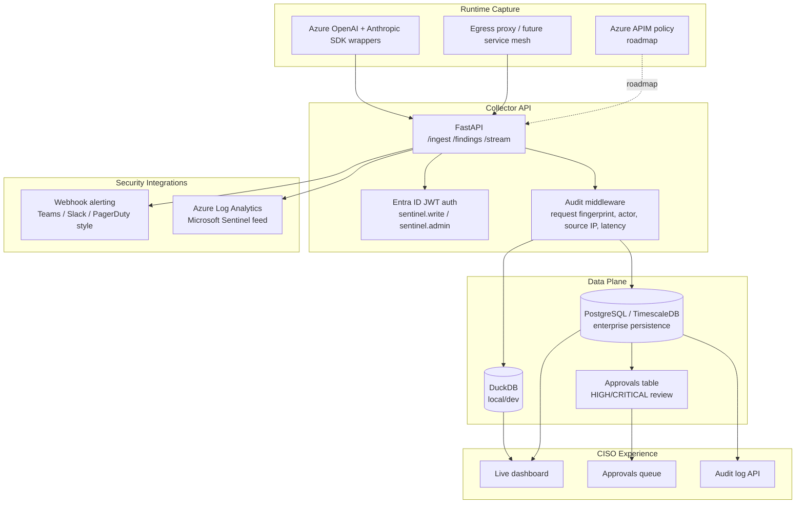

# Part 4 — The Enterprise Foundation

> **Reader path:** [LinkedIn post](../linkedin/04-enterprise-foundation.md) → this design → [code-and-test traceability](../TRACEABILITY.md#publication-traceability)

## In plain terms

**Example.** The system detects an agent sending an unusually large amount of
data to an unapproved destination, a high-severity finding. In a database-
backed deployment that finding doesn't just sit in a log. It waits in an
approvals queue for a signed-in person to decide: legitimate, escalate, or
pause the agent. The reviewer's identity is taken from their sign-in, not
typed in, and the decision becomes part of the audit record.

**Why it matters.** This is the difference between "we have a demo" and "we
can pass your vendor security review." Identity, durable storage, an audit
trail and human sign-off on risk aren't nice-to-haves for a tool touching
regulated data. They're the actual purchase criteria.

## Business value

**What it adds.**

- **Only authorised callers.** Access uses Microsoft Entra ID sign-in, and if
  sign-in isn't configured the system refuses requests rather than opening
  up.
- **Separation of duties.** Sending events, reading findings, approving them
  and reading the audit trail are separate permissions.
- **A human signs off on risk.** High-severity findings wait for a named
  reviewer, and who accessed what is recorded.

**In one line.** The controls a bank's security review asks for, before it
asks about features.

**What it doesn't do (yet).** The built-in dashboard can't sign users in yet,
there's no multi-team isolation, policies still live in files, and an
externally anchored, tamper-proof audit trail is roadmap.

## Design and implementation

Phase 3 turns the pilot into something a regulated security team can evaluate seriously.

### Phase 3 enterprise architecture

| Capability | Current Repo Implementation | Notes |
|---|---|---|
| Auth | [`app/sentinel/api/auth.py`](../../../app/sentinel/api/auth.py) | Entra ID JWT validation when configured; otherwise fails closed unless `SENTINEL_DEV_MODE=1` is explicitly set |
| Collector auth | [`app/sentinel/collector/sdk_base.py`](../../../app/sentinel/collector/sdk_base.py) | SDK reporter accepts a bearer token or token provider; proxy accepts `SENTINEL_AUTH_TOKEN` |
| Audit trail | [`app/sentinel/api/audit.py`](../../../app/sentinel/api/audit.py) | Captures protected endpoints including dynamic approval decisions; payload hash is a fingerprint, not tamper evidence |
| PostgreSQL / TimescaleDB | [`app/sentinel/storage/pg_store.py`](../../../app/sentinel/storage/pg_store.py) | Activated through `DATABASE_URL`; falls back to DuckDB when absent |
| Approval workflow | `/approvals`, `/approvals/{id}` | Auto-created for high/critical findings in Postgres backend |
| SSE live stream | `/stream` | Pushes stats, findings, events, pending approvals every 1.5 seconds |
| Webhook alerting | [`app/sentinel/alerting/webhook.py`](../../../app/sentinel/alerting/webhook.py) | Sends high-signal findings to webhook targets |
| Log Analytics export | [`app/sentinel/siem/log_analytics.py`](../../../app/sentinel/siem/log_analytics.py) | Pushes findings to Azure Monitor / Log Analytics |

### Enterprise gaps still open

| Gap | Why It Matters | Roadmap Direction |
|---|---|---|
| Multi-tenancy | Enterprises need org/team/env isolation | Add `tenant_id`, `org_id`, `environment` across schema and policy |
| Policy lifecycle | YAML files do not scale to many teams | Policy API, GitOps sync, approvals, version history |
| Queue-backed ingestion | Direct HTTP can struggle during bursts | Azure Event Hub or Kafka with replay and DLQ |
| Key management | Env vars are not enough for regulated deployment | Azure Key Vault, managed identity, customer-managed keys |
| HA deployment | Single-node is not production enough | Azure Container Apps/AKS, horizontal replicas, health probes |
| Browser authentication | Built-in dashboard does not acquire/refresh Entra tokens | Add OIDC login and authenticated fetch/stream client |
| Tamper evidence | Payload hashes share the primary database with audit rows | Add hash chaining plus external signing/anchor or WORM storage |

Approval decisions derive `reviewer` from the verified principal's `user_id`;
the caller cannot nominate a different reviewer in the request body. The
current dashboard is therefore a local/dev UI unless it is placed behind an
auth-aware gateway or replaced with the planned OIDC-capable client.

### The two-gate SDLC behind the code

Worth showing, not just the runtime architecture: every change goes through two human approval gates. At Gate 1, a human signs off a frozen specification. The design, build, independent code and security review, tests, and user-acceptance testing follow, and nothing reaches production until a human approves the Gate 2 evidence bundle. The full pipeline lives in the main product repository; this trimmed repo carries only the code and docs the series cites. That process discipline is itself part of the "auditable by design" pitch — the same reasoning behind the compliance-control mapping.

Next: [Part 5 — Feeding the SOC, and What's Next](05-soc-and-whats-next.md).
