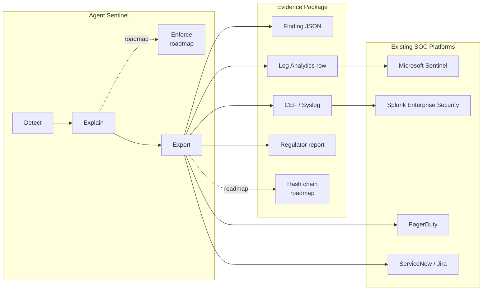
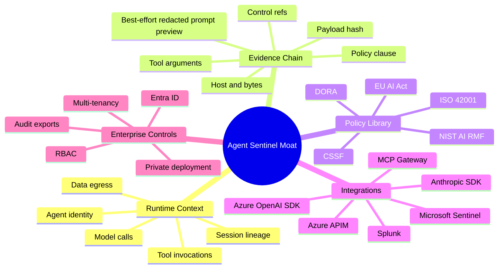

# Part 5 — Feeding the SOC, and What's Next

> **Reader path:** [LinkedIn post](../linkedin/05-soc-and-whats-next.md) → this design → [code-and-test traceability](../TRACEABILITY.md#publication-traceability)

## In plain terms

**Example.** An observed egress event carries a hostname outside the agent's approved list. Sentinel records a finding with the agent, destination, rule, and evidence, then can export it to the existing SOC pipeline. A human or external SOAR process can act on it; Agent Sentinel itself does not currently quarantine the agent.

That last part is the real value. Log collection and incident correlation are solved problems; we're not trying to replace them. What's missing from existing SOC tooling today is first-class understanding of what an AI agent specifically did — and that's the gap this fills.

**Why it matters.** Your security team doesn't need a new screen to watch. They need the evidence about AI-agent behavior to show up, fully formed, inside the tools they already trust and already know how to use under pressure.

## Design and implementation

Microsoft Sentinel and Splunk already do SIEM/SOAR well. Agent Sentinel should export high-fidelity AI-agent findings into them.

## SOC integration architecture



| Integration | Status | Implementation Direction |
|---|---|---|
| Azure Log Analytics | Implemented foundation | [`app/sentinel/siem/log_analytics.py`](../../../app/sentinel/siem/log_analytics.py) |
| Webhook alerting | Implemented foundation | [`app/sentinel/alerting/webhook.py`](../../../app/sentinel/alerting/webhook.py) |
| Microsoft Sentinel workbook | Roadmap | KQL workbook over custom Agent Sentinel table |
| Microsoft Sentinel analytic rules | Roadmap | Rules for critical agent egress, forbidden tool, shadow model |
| Splunk HEC | Roadmap | HTTP Event Collector JSON events |
| Splunk ES app | Roadmap | Notable events, dashboards, investigation workflow |
| ServiceNow / Jira | Roadmap | Ticket creation for escalated approvals |
| Evidence PDF export | Roadmap | Regulator-ready bundle with hash chain |

| Capability | Sentinel / Splunk | Agent Sentinel |
|---|---|---|
| Enterprise log ingestion | Excellent | Feeds enriched AI-agent events into them |
| Incident correlation | Excellent | Provides high-fidelity AI-agent findings |
| SOAR playbooks | Excellent | Triggers them |
| LLM prompt/tool context | Generic unless custom-built | First-class event schema |
| Pre-call enforcement | Limited without custom gateway | Product direction |
| Agent policy-as-code | Not native | Core product feature |
| Evidence chain for AI actions | Custom content | First-class artifact |
| DORA / EU AI Act supporting artifacts | Custom reporting | Control references and evidence fields; applicability still requires legal/scoping analysis |

```text
Do not sell Agent Sentinel as an AI SIEM.
Sell it as the AI-agent runtime control and evidence layer for existing SIEMs.
```

## OSS, enterprise, and the moat



| Area | OSS | Enterprise |
|---|---|---|
| SDK wrappers | Yes | Supported/certified versions |
| Event schema | Yes | Version governance and migration tooling |
| Local collector | Yes | HA collector fleet |
| YAML rules | Yes | Policy workflow, approvals, GitOps |
| DuckDB storage | Yes | Postgres/ClickHouse/Event Hub |
| Dashboard | Yes | RBAC, tenancy, executive reporting |
| SIEM examples | Yes | Certified Sentinel/Splunk apps |
| Compliance mappings | Starter pack | Regulated industry packs and evidence exports |
| Enforcement | Observe/detect | APIM/proxy/block/quarantine are roadmap |

## POC to enterprise grade — the whole arc

| Dimension | Phase 1 POC | Phase 2 Real Pilot | Phase 3 Enterprise Foundation |
|---|---|---|---|
| Ingestion | Simulated HTTP events | Azure/Anthropic SDK wrappers | SDK + proxy + auth + audit |
| Models | Simulated/provider-parsed | Azure OpenAI and Anthropic | Multi-provider governance |
| Storage | DuckDB | DuckDB file or local DB | PostgreSQL / TimescaleDB |
| Detection | YAML rules + baseline | Same engine on real calls | Versioned policy service |
| UX | Local CISO dashboard | Live SSE dashboard | Protected APIs + approvals; OIDC dashboard client is roadmap |
| Identity | Manual `agent_id` | SDK-provided identity | Entra ID and workload identity |
| Enforcement | Observe | Observe/warn | Block/quarantine roadmap |
| Compliance | Control refs | Real-call evidence | Audit log + approvals |
| Deployment | Local / Docker | Staging container | Azure Container Apps / AKS roadmap |
| Product Readiness | Demo | Pilot | Enterprise beta foundation |

### Regulatory scope note

The `control_refs` field helps reviewers navigate to relevant controls; it does
not certify compliance. DORA Articles 18 and 19 concern incident
classification and reporting, Article 25 concerns operational-resilience
testing, and Article 45 concerns cyber-threat information sharing. EU AI Act
Article 12 is framed for high-risk AI systems in scope. Luxembourg entities
must also account for the post-DORA amendments and scope changes to CSSF
Circulars 20/750 and 22/806, including Circular 25/882 for DORA entities' ICT
third-party services. See the [official-source links in the traceability
matrix](../TRACEABILITY.md#regulatory-scope).

Back to [Part 1](01-why-agents-need-a-flight-recorder.md) · [series index](../README.md).
