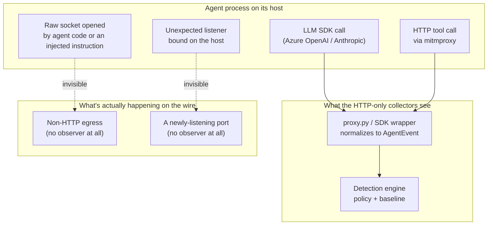

# Part 6 — The Blind Spot Every AI-Agent Firewall Has

> **Reader path:** [LinkedIn post](../linkedin/06-the-blind-spot-every-agent-firewall-has.md) → this design → [code-and-test traceability](../TRACEABILITY.md#publication-traceability)

## In plain terms

**Example.** A library an agent relies on is compromised, and it opens a
direct connection to send data out, with no AI model call and no web request.
A proxy never sees that; it's not recorded as suspicious, it isn't recorded at
all. With the optional network watcher switched on for that agent's machine,
the connection becomes visible, because it watches the machine itself rather
than waiting for traffic to pass a checkpoint.

**Why it matters.** A single blind spot in your monitoring is a single place
where a serious incident goes unrecorded. If your AI monitoring only sees API
calls, ask what it would show you if an agent's traffic never touched an API
at all.

## Business value

**What it adds.**

- **Sees traffic that skips the proxy.** Direct connections and newly opened
  ports on listed agent machines become visible.
- **Covers the attacks that matter most.** A compromised dependency or a
  manipulated agent doesn't need the proxy's permission, so it's exactly
  what a proxy-only view misses.
- **One evidence format.** Network events are recorded and explained the same
  way as everything else.

**In one line.** Visibility for the traffic your proxy never sees.

**What it doesn't do (yet).** It only watches machines you've listed, it's off
until you switch it on, and it doesn't see every action a process takes.

## Design and implementation

Every collector Agent Sentinel has shipped so far — the Azure OpenAI and Anthropic SDK wrappers, the mitmproxy egress tap ([`app/sentinel/collector/proxy.py`](../../../app/sentinel/collector/proxy.py)) — shares one structural assumption: the agent process cooperates. It calls the model SDK you instrumented. It routes its HTTP(S) traffic through the proxy you put in front of it. The collector normalizes what shows up and hands it to the detection engine.

That assumption is usually true. It is not guaranteed to stay true, and the case where it breaks is exactly the case a CISO cares about most.

### What "HTTP-only" actually means

[`app/sentinel/collector/proxy.py`](../../../app/sentinel/collector/proxy.py) is an mitmproxy addon: it hooks the `response()` event on every flow that passes through the proxy and POSTs a normalized record to `/ingest`. That is real, useful visibility — but it is visibility into a *choice*. An agent process that opens a raw TCP or UDP socket directly, spins up a listener on its own host, or exfiltrates data over a channel that never touches the configured proxy is invisible to this pipeline end to end. Not under-logged. Not scored low. Not present in `events` at all.

[`docs/adr/0008-nmap-tshark-network-collector.md`](../../../docs/adr/0008-nmap-tshark-network-collector.md)'s Context section states this plainly: every existing collector "sees only HTTP(S) traffic that an agent chooses to route through them," and an agent that is prompt-injected or otherwise compromised into opening a raw socket or exfiltrating over a non-HTTP channel is invisible to the pipeline end to end. That is not a hypothetical edge case for an SDK-wrapper-based architecture — it is the direct consequence of instrumenting the *call site* instead of the *wire*.

### Two very different views of the same host

The left path — SDK wrapper or proxy, into `AgentEvent`, into the policy and baseline layers — is the pipeline every earlier post in this series describes. The right path is not a degraded version of that pipeline; it is a total absence of one. There is no partial record, no low-confidence event, no missed-but-loggable flow. If the traffic never enters the proxy or the SDK, the collector simply never runs.

### Why this matters for a regulated deployment

Agent Sentinel is an observability and policy-detection layer for AI agents and M2M identities in regulated environments — reconciliation bots, KYC assistants, payments copilots. The threat model that matters for that audience isn't only "will the agent call an unapproved LLM." It also includes a prompt-injected agent or compromised dependency doing something that was never expressed as an HTTP call through an instrumented path — a reverse shell, a scan of the local network, or a listener bound so another process can reach it later. None of that requires cooperating with proxy configuration. All of it requires only that the host's network stack still works.

[`docs/adr/0008-nmap-tshark-network-collector.md`](../../../docs/adr/0008-nmap-tshark-network-collector.md) frames the fix narrowly and deliberately: not a general-purpose network security scanner, but visibility scoped specifically to hosts that *are* agent or M2M identities — consistent with this repo's existing stance that Sentinel is an agent/M2M-identity-centric control, not a LAN-wide monitoring tool. The next four posts in this series walk through how that visibility is built, how tightly it's scoped, what it turns into an explainable finding, and — just as importantly — a real design mistake that was caught before it ever shipped.

Next: [Part 7 — Visibility Without a Blank Check](07-visibility-without-a-blank-check.md).
