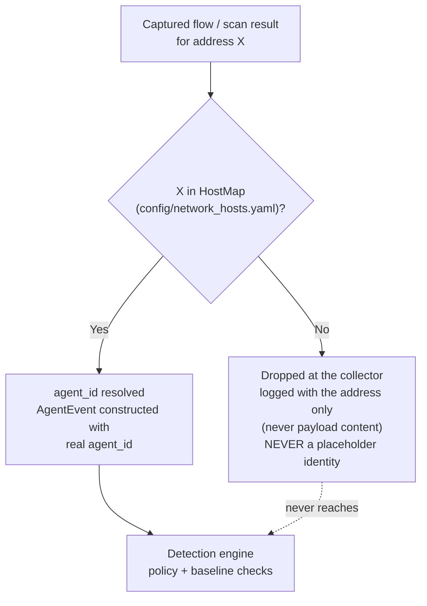

# Part 7 — Visibility Without a Blank Check

> **Reader path:** [LinkedIn post](../linkedin/07-visibility-without-a-blank-check.md) → this design → [code-and-test traceability](../TRACEABILITY.md#publication-traceability)

## In plain terms

**Example.** Someone's laptop, not an agent's machine, sends traffic across
the same network the tool is watching. Its address was never added to the
list, so the traffic is dropped on the spot and logged only as "an address we
don't recognise": no content, no attribution, no finding. Only traffic from
machines an operator explicitly named ever reaches the checks.

**Why it matters.** The right question for any new monitoring capability isn't
"can it see more", it's "who has to worry about it now." A tool scoped this
tightly is one your own security review can approve without a long list of
caveats.

## Business value

**What it adds.**

- **Only the machines you name.** It watches a list of individual addresses;
  it never sweeps a network or a range.
- **No guessing whose traffic it is.** Every address is mapped in advance to a
  named agent; anything else is dropped, with only the address logged.
- **Off until you decide twice.** Nothing runs until someone writes the list
  and separately switches monitoring on.

**In one line.** Network visibility that can't turn into surveillance.

**What it doesn't do (yet).** Each list entry is a single address, not a
range, and live watching and port scanning both stay off until an operator
enables them.

## Design and implementation

Closing the blind spot from Part 6 the wrong way creates a worse problem than the one it solves: a tool that captures or probes traffic on a network you don't fully own is itself a compliance and trust liability. So the design constraint that shaped [`app/sentinel/collector/network_scan.py`](../../../app/sentinel/collector/network_scan.py) from the start wasn't "see more" — it was "see only what's explicitly authorized, and prove it never sees anything else."

### Two modes, one allow-list

The collector runs two distinct modes against the same operator-authored address allow-list, never a subnet sweep. Host-map loading rejects CIDRs, ranges, and hostnames: each `address` must parse as one IPv4 or IPv6 literal.

- **Live capture** (`LiveCaptureSupervisor`) runs `tshark -i <if> -T ek` as a supervised subprocess. Its `build_argv()` doesn't just filter events after the fact — it builds a BPF capture filter (`"host <addr> or host <addr> ..."`) from the allow-list and passes it to tshark with `-f`, so the scoping happens at the kernel capture level, not as a post-hoc discard. If the allow-list is empty, `build_argv()` raises rather than falling back to an unfiltered, capture-everything invocation.
- **Periodic inventory** (`InventoryJob`) runs scheduled `nmap -sT -sV` scans against the same allow-list, one address at a time, and diffs each result against the last-known state for that host.

[`docs/adr/0008-nmap-tshark-network-collector.md`](../../../docs/adr/0008-nmap-tshark-network-collector.md)'s Decision section is explicit that this is "a configured allow-list of agent/M2M host addresses (never a full subnet sweep)," and the ADR's Alternatives table rejects full subnet/LAN scanning outright: it's out of product scope, would misrepresent what the tool is for, and would create noise from devices that have no agent relationship at all.

### Identity is looked up, never inferred

The second constraint is just as deliberate: an address is only ever attributed to an `agent_id` through an explicit, operator-authored mapping — never guessed from traffic patterns. [`app/sentinel/collector/host_map.py`](../../../app/sentinel/collector/host_map.py) implements this as `HostMap`, loaded from `config/network_hosts.yaml` (a committed template, [`config/network_hosts.example.yaml`](../../../config/network_hosts.example.yaml), documents the shape). `HostMap.resolve()` does a straight dictionary lookup by address or MAC and returns `None` — never a placeholder identity — when nothing matches.

The ADR's Alternatives table rejects the tempting shortcut here too: inferring agent identity from traffic patterns via ML or heuristic fingerprinting is called out as a violation of this repo's rules-first detection principle (ADR 0001) — host-to-agent attribution has to be an explicit, auditable mapping an operator configured, not an inferred guess a model produced.

This lookup is also structurally separate from the policy engine. `AgentPolicy.allowed_hosts` (checked in `detection/policy.py`) answers "what is this already-identified agent allowed to talk to." `HostMap` answers the opposite-direction question — "which agent owns this address" — *before* an `AgentEvent`, and therefore an `agent_id`, exists at all. The ADR's own Revision History records that an early draft conflated these two lookups; the accepted design keeps them in genuinely separate modules (`collector/host_map.py` is outside `detection/` entirely) so they can never be cross-loaded or confused.

### What happens to an address that isn't mapped

Both `parse_ek_line()` (live capture) and `InventoryJob._diff_and_emit()` (inventory) call `host_map.resolve()` before constructing an `AgentEvent`, and both log and return without emitting on a miss. The live supervisor increments its unattributable-record drop counter; the inventory job logs the rejected result. Traffic from an unmapped address is never ingested under a synthesized or placeholder identity.

### Off by default, and it stays that way until you say twice

Both `CaptureConfig.enabled` and `ScanJobConfig.enabled` default to `False` ([`app/sentinel/collector/scan_config.py`](../../../app/sentinel/collector/scan_config.py)). [`docs/NETWORK_COLLECTOR.md`](../../../docs/NETWORK_COLLECTOR.md)'s scan-authorization statement distinguishes the two: live tshark capture passively observes packets for allow-listed hosts on the selected interface, while nmap inventory actively sends port-scan probes. Either mode requires an explicit operator choice; only inventory generates probe traffic.

Getting from "installed" to "running" takes two separate, positive acts: authoring `config/network_hosts.yaml` with real addresses, *and* setting `enabled: true` on the relevant job. There's no single flag that scans hosts you haven't explicitly listed, and the collector never scans a subnet or CIDR — only the exact addresses on that list.

Next: [Part 8 — From Open Port to Explainable Finding](08-from-open-port-to-explainable-finding.md).
