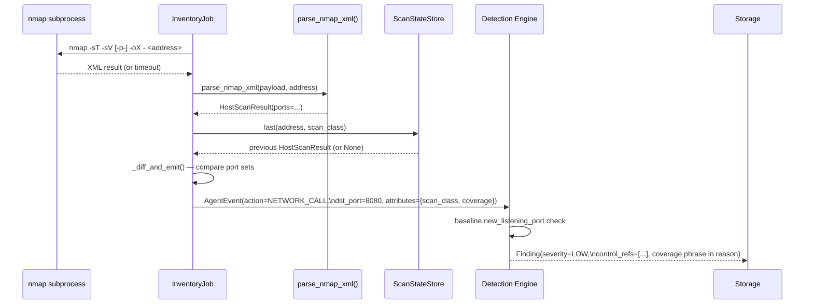

# Part 8 — From Open Port to Explainable Finding

> **Reader path:** [LinkedIn post](../linkedin/08-from-open-port-to-explainable-finding.md) → this design → [code-and-test traceability](../TRACEABILITY.md#publication-traceability)

## In plain terms

**Example.** A scheduled check on an approved machine finds a port open that
wasn't open last time. The finding says how thorough that check was (the
common ports, or every port), marks it low severity because an open port alone
isn't proof of a violation, and cites the regulatory controls it relates to. A
reviewer gets the context without mistaking a quick check for a complete one.

**Why it matters.** Most dashboards can't tell you the difference between "we
checked, and it's clean" and "we didn't actually check that." That distinction
is what makes a finding something a CISO can put in front of a board or a
regulator.

## Business value

**What it adds.**

- **States how thorough the check was.** A quiet result from a quick scan is
  never presented as a complete one.
- **Severity matches the evidence.** A new open port is flagged as low and
  advisory, not an alarm.
- **Traceable to a control.** Every finding cites the regulatory controls it
  relates to.

**In one line.** Scan results turned into evidence an auditor can trace.

**What it doesn't do (yet).** Only newly opened ports found by scheduled
checks become findings, and there's no policy yet for which ports a machine is
expected to have open.

## Design and implementation

A raw nmap result or a tshark capture line is not evidence — it's a data point. What makes it useful to a security reviewer is the chain that turns it into a `Finding`: normalized fields, a stated coverage boundary, a severity that matches what the system actually knows, and control references an auditor can trace. That chain is the same one every other collector in this repo feeds — Part 6 and Part 7 covered how traffic gets scoped and attributed; this post covers what happens once an `AgentEvent` exists.

### Five new fields, one schema

[`app/sentinel/schema/events.py`](../../../app/sentinel/schema/events.py) adds exactly five optional, defaulted fields to `AgentEvent` for this collector: `src_ip`, `dst_ip`, `dst_port`, `protocol`, and `mac`. They're additive — every existing collector and consumer of `AgentEvent` is unaffected, and no validator can raise on hostile capture input reaching them. Critically, `host` (the pre-existing field every policy check already reads) is *not* one of the five — it keeps its existing meaning and is populated by a narrower rule covered in Part 9.

### Scan → parse → diff → event → finding



`InventoryJob._diff_and_emit()` in [`app/sentinel/collector/network_scan.py`](../../../app/sentinel/collector/network_scan.py) is deliberately a *diff*, not a dump: it compares the current scan's port set against the last-known state for that `(address, scan_class)` pair and emits an event only for what changed — `new_open_port`, `port_closed`, `host_appeared`, or `host_unreachable`. A scan that finds nothing new produces zero events, not a restated snapshot of everything still open.

### The coverage phrase — never an unqualified claim

This is the detail that keeps a "quiet" scan from becoming a false sense of security. There are two, separately-scheduled scan classes — `ScanClass.TOP_1000` (nmap's default port set, no `-p` flag, run hourly) and `ScanClass.FULL_RANGE` (`-p-`, the full TCP range, run at most daily) — and `network_scan.py`'s `COVERAGE_PHRASE` dict maps each to a fixed human-readable string:

```python
COVERAGE_PHRASE: dict[ScanClass, str] = {
    ScanClass.TOP_1000: "in nmap's default top-1000 TCP port set",
    ScanClass.FULL_RANGE: "in the full TCP port range (-p-)",
}
```

Every event this collector emits carries the matching phrase in its `attributes["coverage"]`, and [`docs/COMPLIANCE.md`](../../../docs/COMPLIANCE.md)'s "Network security" section states the rule this exists to enforce: a finding or report that doesn't say which scan class produced it "is a compliance-claim bug, not a stylistic choice." A quiet top-1000 result is coverage of 1,000 common ports — not a "no open ports" or "clean host" claim. The two scan classes also keep independent diff state per host, so a port first seen by one class is never misreported as newly opened or closed by the other.

### `baseline.new_listening_port` — the actual check

[`app/sentinel/detection/engine.py`](../../../app/sentinel/detection/engine.py) implements the check that consumes these events. It requires `collector == "network_scan"`, `capture_mode == "inventory"`, and `net_change == "new_open_port"`, plus a baseline `is_new_port(dst_ip, dst_port)` result for a host with prior port history. Live packet events and `port_closed` inventory events cannot enter this rule. The resulting `Finding` folds the coverage phrase directly into its explanation text:

```python
coverage = e.attributes.get("coverage")
coverage_phrase = f" (scanned {coverage})" if coverage else ""
...
reason=(
    f"Agent '{e.agent_id}' host '{dst_ip}' has a newly-observed "
    f"listening port {dst_port}{coverage_phrase}; it has no prior "
    f"history of this port being open."
),
control_refs=(p.control_refs if p else NETWORK_CONTROL_REFS),
```

Every finding carries real `control_refs` — either the owning agent's own policy-declared references, or a fallback list (`NETWORK_CONTROL_REFS` in `engine.py`) mapping to DORA Art. 9 (protection and prevention), DORA Art. 10 (detection), and EU AI Act Art. 15 (accuracy, robustness and cybersecurity) when the agent has no policy of its own to draw from. That's the same discipline this repo has applied to every other finding type since Part 1: never a raw anomaly score, always an explanation and a control reference an auditor can follow back to an obligation.

Next: [Part 9 — Built to Fail Safe, Not Fail Quiet](09-built-to-fail-safe-not-fail-quiet.md).
