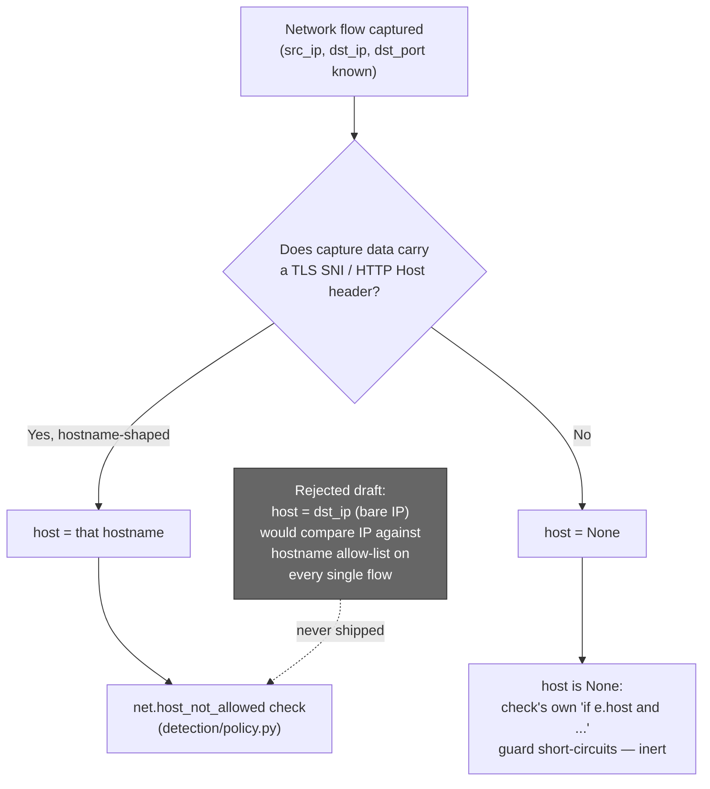

# Part 9 — Built to Fail Safe, Not Fail Quiet

> **Reader path:** [LinkedIn post](../linkedin/09-built-to-fail-safe-not-fail-quiet.md) → this design → [code-and-test traceability](../TRACEABILITY.md#publication-traceability)

## In plain terms

**Example.** A normal agent sends traffic to its approved ledger service. An
early design of the network feature would have recorded only the machine's
number address, then compared it with the agent's approved list of names. They
never match, so every legitimate flow would have raised a high-severity alarm.
In the shipped design, the check uses the real service name when the traffic
carries one, and is skipped when it doesn't. Tests prove the legitimate case
produces no alarms.

**Why it matters.** A security tool that cries wolf on everything trains
people to stop reading it, and that's exactly when a real violation gets
missed. Catching this in design review, before any collector code existed, was
the cheapest possible day to catch it.

## Business value

**What it adds.**

- **No false-alarm flood.** Adding network visibility doesn't turn every
  existing agent's normal traffic into violations.
- **The rule never guesses.** It compares real service names only, or stands
  aside.
- **Guarded by tests.** Regression tests prove legitimate traffic stays quiet.

**In one line.** New visibility without new noise.

**What it doesn't do (yet).** Traffic that carries no service name isn't
checked against the approved list; Part 10 explains why.

## Design and implementation

Part 8 showed the LOW-severity, advisory `baseline.new_listening_port` check. This post is about a different, higher-stakes check that this feature could have silently broken — and the design-review step that caught it before a single line of the collector was written.

### The check that was already in production

[`app/sentinel/detection/engine.py`](../../../app/sentinel/detection/engine.py)'s `net.host_not_allowed` check is one of the oldest rules in this repo. It creates a HIGH-severity policy finding when an **egress** event carries a remote hostname outside the owning agent's non-empty `allowed_hosts` list. It records a verdict; it does not block the packet. `allowed_hosts` is an exact-match hostname list, not a pattern or IP range.

### The draft that would have broken it

An earlier version of this feature's design would have populated `AgentEvent.host` straight from the network collector's raw captured destination IP (`dst_ip`). That reads as a reasonable default — of course a network event should carry the address it went to. It's also exactly wrong for how `allowed_hosts` matching works.

Think through the consequence: every agent already running with a normal, pre-existing hostname-based `allowed_hosts` policy — which is to say, effectively every agent using this feature at all — would have every single network-capture flow compared against a hostname list using a bare IP literal. `10.0.4.17` never equals `ledger.internal`, no matter how legitimate the traffic. The result isn't a missed detection; it's the opposite failure mode — a HIGH-severity `net.host_not_allowed` finding fired on **every captured packet flow**, for agents that did nothing wrong. [`docs/NETWORK_COLLECTOR.md`](../../../docs/NETWORK_COLLECTOR.md) names this directly as "a false-positive storm that would also bury genuine egress violations in noise."

That's the worse of the two failure directions for a compliance-facing control. A missed detection is bad. A control that cries wolf on every legitimate agent trains its own reviewers to ignore it — and the next real violation gets buried in the noise this bug would have generated.

### The fix is structural, not a patch

The corrected design makes `AgentEvent.host` the **remote egress hostname**: populated only for an outbound packet from a hostname-shaped TLS SNI or HTTP `Host` value already present in the capture. It is never a bare IP and never the result of a live DNS lookup. A `hostname:` in `network_hosts.yaml` labels the monitored machine for operator context; it is not copied into the remote-destination field. Inbound events and outbound packets with no captured hostname carry `host=None`.

A `None` host is inert for the egress-host check. The rule also requires `direction == EGRESS`, so inbound traffic cannot be compared with an egress allow-list. These two guards prevent the monitored machine's own label from becoming a false remote destination.

### Proven, not just asserted

The fix has three regression paths: `test_r15_hostname_only_allowed_hosts_produces_zero_host_not_allowed_findings` and `test_monitored_host_label_never_triggers_egress_allow_list_rule` in [`app/tests/test_network_pipeline.py`](../../../app/tests/test_network_pipeline.py), plus `test_inbound_packet_is_attributed_as_ingress_and_has_no_egress_host` in [`app/tests/test_network_capture.py`](../../../app/tests/test_network_capture.py). Together they assert correct direction, remote-host meaning, and zero false egress-policy findings for monitored-host labels.

### Why this is the actual story worth telling

This wasn't caught by a customer complaint, or by an on-call engineer triaging an alert storm at 2am. It was caught in design review, before a single line of the collector was written — while the fix still meant changing a design document, not patching production and apologizing to a customer whose real detections got lost in noise you created. The value isn't that a bug never happens. It's that a false-positive-generating design flaw got caught at the design stage, on the cheapest possible day to catch it.

Next: [Part 10 — What This Doesn't Do Yet](10-what-this-doesnt-do-yet.md).
