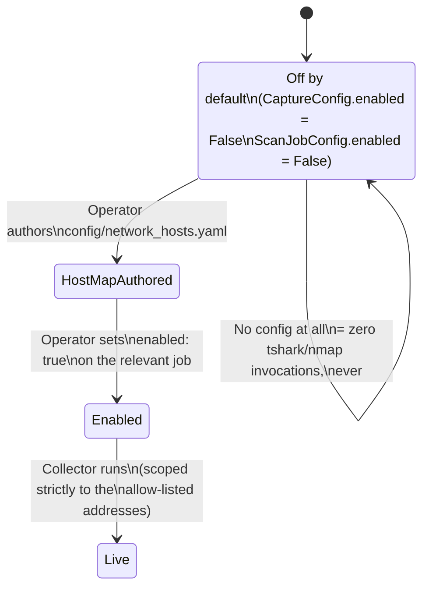

# Part 10 — What This Doesn't Do Yet

> **Reader path:** [LinkedIn post](../linkedin/10-what-this-doesnt-do-yet.md) → this design → [code-and-test traceability](../TRACEABILITY.md#publication-traceability)

## In plain terms

**Example.** Say outbound traffic has no TLS SNI or HTTP Host value. The packet can be stored with its raw address and port, but the hostname allow-list has nothing safe to compare, so that rule does not fire. Separately, if a later authorized inventory scan finds a listening port that was not in its previous baseline, that scan can create a low-severity finding. Those are two different observations and must not be presented as one causal event.

**Why it matters.** Neither of these is a secret. Both are written down plainly, the same place a customer's security team would look. A security capability that's honest about what it doesn't cover yet is more trustworthy than one that implies it covers everything — that's the standard this series has tried to hold to throughout: the flight recorder, the rules-first design, the fail-safe fix in Part 9, and now this.

That's the series.

## Design and implementation

The first four posts in this series covered what the network-visibility collector sees, how tightly it's scoped, how a capture turns into an explainable finding, and a false-positive bug that was caught before it shipped. This last post covers what it deliberately does not do — because a security capability that hides its own limits is worse than one that states them plainly, and this repo's own compliance posture ([`docs/COMPLIANCE.md`](../../../docs/COMPLIANCE.md)) is built on that principle.

## Gap one: IP-only traffic isn't checked against `allowed_hosts`

Part 9 covered why `AgentEvent.host` is only ever populated from a genuine remote hostname — never a bare IP. That leaves a known coverage gap: if an outbound captured packet has no hostname in TLS SNI or the HTTP `Host` header, it is outside `net.host_not_allowed` evaluation because there is nothing safe to compare with the hostname allow-list.

The packet can still be stored with `dst_ip` and `dst_port`, but live packet events do **not** drive `baseline.new_listening_port`. That finding comes only from the independent nmap inventory diff when it emits `net_change=new_open_port`. Egress-policy evaluation does not extend to raw IP destinations in this release. Closing that gap requires an explicit IP/CIDR policy model rather than comparing an IP with a hostname list.

## Gap two: shipped, tested, and off

This collector exists in the codebase — built, reviewed, and covered by its own test suite — but turning it on against a live environment is explicitly future work, not part of this release. [`docs/NETWORK_COLLECTOR.md`](../../../docs/NETWORK_COLLECTOR.md)'s scan-authorization statement makes the boundary explicit for operators: both `CaptureConfig.enabled` and `ScanJobConfig.enabled` default to `False`, and getting from "installed" to "capturing packets against your hosts" takes two separate, positive, operator-authored acts — a real `config/network_hosts.yaml` and an explicit `enabled: true`.

That's a deliberate posture, not a shortcut: live tshark capture passively observes packets, while nmap inventory actively sends port-scan probes against real hosts. Both require authorization because capture affects privacy and scanning creates traffic; only inventory probes the targets.

## Where this points next

Positioned against this series' running framing — Detect, Explain, Export, with Enforce on the roadmap — this feature is squarely a **Detect** capability. It closes part of the non-HTTP visibility gap from Part 6, attributes observed mapped traffic to real agent identities without inferring one, and turns qualifying inventory changes into explainable, control-referenced findings. It does not yet **Enforce** anything at the network layer: `baseline.new_listening_port` is LOW-severity and advisory by design ([`docs/COMPLIANCE.md`](../../../docs/COMPLIANCE.md) is explicit that this is deliberate — no `allowed_ports` field exists on `AgentPolicy` yet, so there's no operator-authored clause a HIGH/policy verdict could cite), and IP-only traffic sits outside the hostname-based `allowed_hosts` detection for the reasons above.

Both of those are natural next steps, not open questions about whether this feature works: an `AgentPolicy` field for expected listening ports would give a real clause to escalate against; IP-aware matching would close the allow-list gap for traffic with no resolvable hostname. Neither made it into this release, and that's the honest way to say it — a v1 that sees clearly and explains what it finds, with the enforcement layer deferred to a design review of its own rather than bolted on as an afterthought.

Back to [Part 1](01-why-agents-need-a-flight-recorder.md) · [series index](../README.md).
